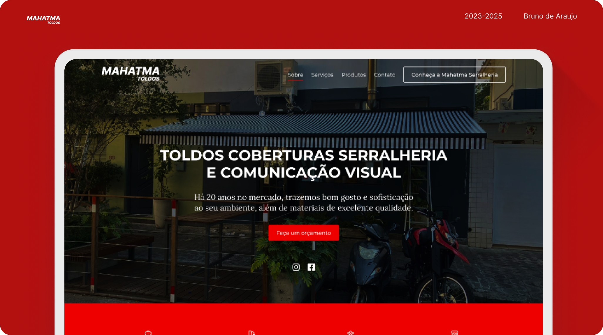

# Mahatma Toldos – Site Institucional

✅ Projeto real desenvolvido para a empresa **Mahatma Toldos**, especializada em coberturas, serralheria e comunicação visual.

🔗 Acesse o site online: [https://mahatmatoldos.com.br](https://mahatmatoldos.com.br)

## ✨ Sobre o projeto

Este foi o meu primeiro projeto real, iniciado em 2018 após concluir meu primeiro curso de Web Design. Em 2023, fui novamente contratado para refazer o site com um novo layout, mais moderno e responsivo. Em 2025, realizei atualizações pontuais por solicitação do cliente.

## 💼 Minhas responsabilidades

- Design da interface no Figma
- Desenvolvimento com HTML, CSS e JavaScript
- Integração com PHP para o formulário de contato
- Atualizações contínuas e manutenção

## 🚀 Tecnologias utilizadas

Figma · HTML · CSS · JavaScript · PHP

## 📸 Prints do site

> *(Você pode subir uma imagem chamada `screenshot-home.png` e mostrar aqui)*

## 📍 Status do projeto

✔️ Concluído e publicado
